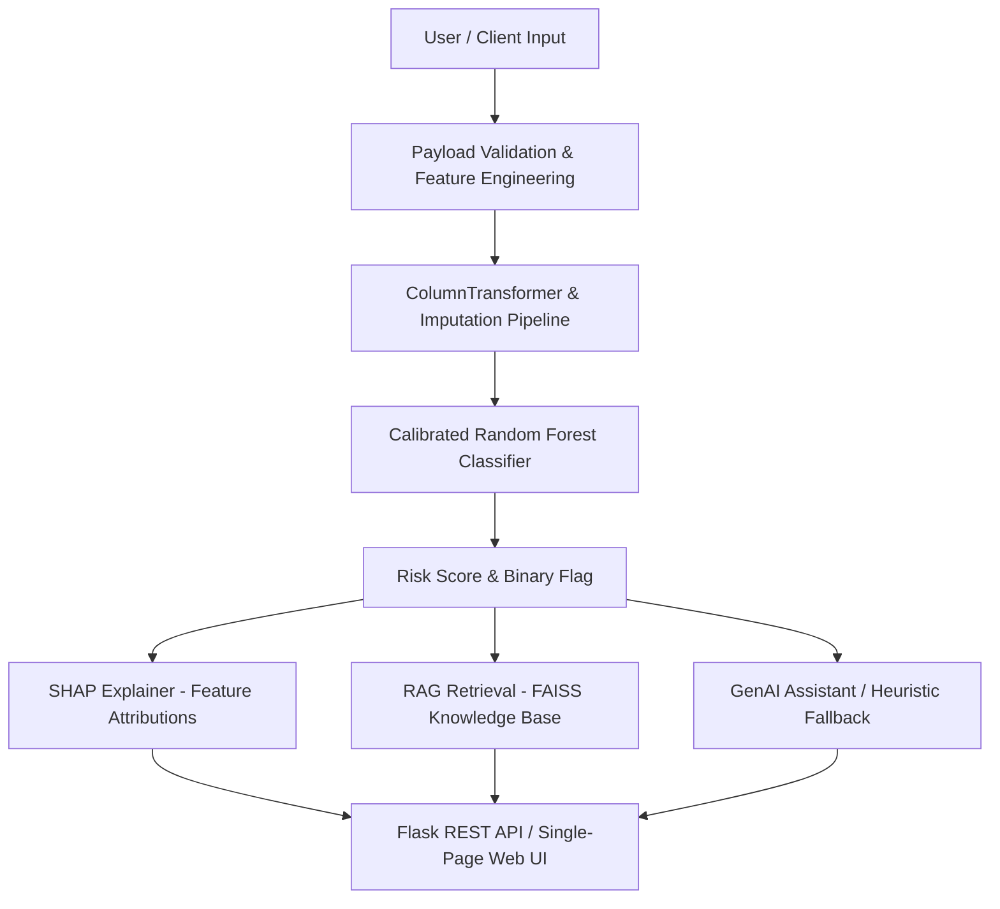

# Fake Social Media Account Detector

The **Fake Social Media Account Detector** is an end-to-end machine learning system that evaluates social media profiles to determine their probability of being fake, bot-driven, or inauthentic. It combines a calibrated Random Forest classifier, SHAP feature attributions, a RAG knowledge base, and an optional GenAI narrative summary into a unified Flask API and interactive web interface.

---

## 🚀 Key Features

- **Machine Learning Classification**: Trained supervised classifier scoring account authenticity from public metadata.
- **Calibrated Risk Probabilities**: Isotonic calibration mapping raw outputs to true statistical probabilities.
- **Explainable AI (SHAP)**: Per-request feature attribution highlighting positive and negative risk factors.
- **RAG-Grounded Context**: Sentence-Transformers + FAISS semantic retrieval over an OSINT bot-investigation knowledge base.
- **GenAI Investigation Narrative**: Natural-language summary synthesis with zero-dependency deterministic fallback.
- **Versioned REST API & Single-Page UI**: Clean `/api/v1` REST endpoints and a modern dark-themed web interface.
- **Automated Test Suite**: 93 unit and integration tests covering features, models, RAG, GenAI, and API routes.

---

## 📊 Model Performance

Evaluated on an unbiased **120-row frozen holdout test set** (60 fake / 60 legitimate) never seen during tuning or selection:

| Metric | Value | Details |
|---|---|---|
| **Accuracy** | **87.5%** | 105 / 120 correct classifications |
| **Precision** | **95.9%** | 47 / 49 flagged accounts are true fakes (FPR = 3.3%) |
| **Recall** | **78.3%** | 47 / 60 fakes detected |
| **F1 Score** | **86.2%** | Primary balanced optimization metric |
| **ROC-AUC** | **0.9607** | High discriminative ranking performance |
| **PR-AUC** | **0.9634** | Robust area under precision-recall curve |
| **Brier Score** | **0.0962** | Low probability calibration error |

* **Training Set**: 576 labeled rows (Kaggle Bakhshandeh dataset).
* **Cross-Validation**: 5-fold stratified CV during hyperparameter search.

---

## 🏗️ System Architecture



> **Architecture Notes**:
> - **ML Model**: Primary engine responsible for core classification and probability estimation.
> - **GenAI Narrative**: Explanatory UX layer that synthesizes evidence; it does **not** override or decide classifications.
> - **RAG Layer**: Provides grounded contextual guidance from domain investigation documents.

---

## ⚡ Quick Start

### 1. Clone & Setup
```bash
git clone https://github.com/SHREENIDHI2004/fake-SocialMedia-Account-Detector.git
cd fake-SocialMedia-Account-Detector
```

### 2. Create Environment & Install Dependencies
```bash
python -m venv .venv
# On Windows:
.venv\Scripts\activate
# On Linux/macOS:
# source .venv/bin/activate

pip install -r requirements.txt
```

### 3. Environment Configuration
```bash
copy .env.example .env
```

### 4. Run Application
The pre-trained model artifacts (`models/v1/calibrated_pipeline.joblib`) are included in the repository. The application works **immediately out-of-the-box**:
```bash
python wsgi.py
```
- **Web UI**: Open `http://127.0.0.1:5000/` in your browser.
- **Health Check**: `http://127.0.0.1:5000/api/v1/health`

---

## 1. Detailed Project Overview

## 5. ML methodology

1. **Data source** — Kaggle Bakhshandeh Instagram fake-vs-real dataset (see §22).
2. **Train/test split** — `tuned_on_rows=576` (training), `frozen_test_rows=120` (60 positive / 60 negative). Frozen set was NOT used for any preprocessing fit, feature selection, hyperparameter search, or model selection.
3. **Feature engineering** — dataframe constructed from raw account record → 40+ engineered features (§7).
4. **Preprocessing pipeline** — per-feature-type ColumnTransformer with imputation (adds missing-indicator columns), scaling (RobustScaler for numeric; standard is an option), and one-hot encoding of categorical flags.
5. **Model search** — RandomizedSearchCV (`n_iter=30`, `cv=5`) over 5 model families. Random Forest won on mean CV F1.
6. **Best Random Forest hyperparameters** — `n_estimators=300`, `min_samples_leaf=10`, `max_features="log2"`, `max_depth=20`, `class_weight="balanced_subsample"` (random_state=42).
7. **Calibration** — `CalibratedClassifierCV` with `method="isotonic"` refit on the 576-row training split.
8. **Threshold selection** — swept threshold over the 5-fold OOF predictions, maximized F1 subject to `FPR ≤ 0.15`. Selected: **0.50**. OOF at 0.50: F1=0.9299, FPR=0.087.
9. **Final evaluation** — applied the calibrated model + selected threshold exactly once to the frozen 120-row test set. Results §10.

## 6. Feature engineering

Raw input schema (all fields except `username` are semantically optional — missing values are imputed):

| Field                         | Type        | Semantics                                    |
|-------------------------------|-------------|----------------------------------------------|
| `username`                    | string      | Account handle                               |
| `full_name`                   | string/null | Display name                                 |
| `followers`                   | int/string/null | Follower count                           |
| `following`                   | int/string/null | Following count                          |
| `posts`                       | int/string/null | Post count                               |
| `bio`                         | string/null | Profile biography                            |
| `has_profile_pic`             | bool/null   | Has profile picture uploaded                 |
| `has_external_url`            | bool/null   | Bio or header links to external site         |
| `is_private`                  | bool/null   | Account set to private                       |
| `is_verified`                 | bool/null   | Platform verified badge                      |
| `account_age_days`            | int/null    | Days since account creation                  |
| `#followers` / `profile pic`  | aliases     | Legacy Kaggle naming accepted                |

Engineered features are grouped into four modules:

- **Ratio features** — follower/following ratio, inverse ratio, posts-per-follower, log1p-transformed counts, per-day rates (`followers_per_day_age`, `posts_per_day_age`, log1p account age). Division-by-zero-safe.
- **Text features** — digit ratios in username and fullname; `name_equals_username` flag; URL presence in bio; spam-keyword hit count (`free`, `money`, `giveaway`, `discount`, `promo`, `crypto`, `bitcoin`, `earn`, `investment`, `lottery`, `winner`, `guaranteed`, `limited offer`, `exclusive deal`, `follow me`, `f4f`, `sfs`, `l4l`, `dm me`, `link in bio`, `click link`, `win now`).
- **Profile flags** — `is_verified`, `is_private`, `has_profile_pic`, `has_external_url` (passed through, NaNs preserved for the imputer).
- **Rule signals** — binary indicators for thresholds the investigators care about: low follower/following ratio (`< 0.1` very, `< 0.5` moderate), zero-posts-with-high-followers, missing profile picture, very young account (<30 days), young account (<90 days), very high following (>10000), bio spam-kw count ≥2.

All NaN-safe integer coercion is handled by `ml/features/engineering.py:_safe_int`, which defensively converts string floats, NaN, None, and infinities to a configured default (usually 0 or NaN depending on feature group semantics).

## 7. NLP / text processing

Text features are computed from `username`, `full_name`, and `bio`. The NLP pipeline is intentionally lightweight (no neural NER or parsing) so scoring stays sub-10 ms after the model is loaded:

- **Digit ratio** — `len(digits) / max(1, len(chars))` computed over username and full name. Fake accounts tend to use numeric suffixes to disambiguate handles.
- **`name_equals_username`** — lowercased + whitespace-stripped exact match check between full_name and username; fakes commonly copy the handle as the display name.
- **bio URL detection** — regex `re.search(r"https?://|www\.|\.com|\.co|\.io|\.org|\.net", bio)` returns 0/1.
- **Spam keyword hit count** — case-insensitive substring hit count over the 18-phrase lexicon listed in §6. Counts ≥2 also flip a `rule_signal: bio_spam_keywords`.

The heavier embedding NLP lives in RAG (sentence-transformers) and is only used to retrieve relevant investigation snippets, not to classify.

## 8. Model comparison

5-fold cross-validation on the 576-row training split. Random Forest won on mean F1 and was therefore promoted to final model.

| model                  | accuracy_mean | precision_mean | recall_mean | **f1_mean** | roc_auc_mean | pr_auc_mean | fit_time (s) |
|------------------------|---------------|----------------|-------------|-------------|--------------|-------------|--------------|
| random_forest          | 0.9236        | 0.9133         | 0.9376      | **0.9245**  | 0.9742       | 0.9749      | 0.65         |
| hist_gradient_boosting | 0.9184        | 0.9168         | 0.9235      | 0.9181      | 0.9755       | 0.9753      | 0.40         |
| gradient_boosting      | 0.9149        | 0.9012         | 0.9340      | 0.9164      | 0.9754       | 0.9773      | 0.81         |
| logistic_regression    | 0.9149        | 0.9090         | 0.9236      | 0.9153      | 0.9710       | 0.9626      | 0.08         |
| extra_trees            | 0.9080        | 0.9353         | 0.8785      | 0.9045      | 0.9790       | 0.9796      | 0.49         |

Tradeoffs: Extra Trees and HistGradientBoosting have slightly better ROC-AUC but materially worse F1 (the user's chosen primary metric) and/or precision / recall imbalance vs Random Forest. Random Forest's 0.9245 mean F1 with ±0.007 std across folds had the best combination of strength and stability.

Source: `reports/model_comparison_cv.csv`.

## 9. Final model

- **Base classifier:** `sklearn.ensemble.RandomForestClassifier` with calibrated wrapper.
- **Hyperparameters:** `n_estimators=300`, `min_samples_leaf=10`, `max_features="log2"`, `max_depth=20`, `class_weight="balanced_subsample"`, `random_state=42`.
- **Calibration:** `sklearn.calibration.CalibratedClassifierCV(method="isotonic")` fit on the 576-row training split.
- **Input type:** DataFrame produced by `ml.features.engineering.build_feature_frame(list_of_account_records)`.
- **Prediction type:** `predict_proba[:, 1]` (positive-class probability from the calibrated pipeline).
- **Decision threshold:** 0.50 (OOF sweep, FPR ≤ 0.15, max F1).
- **Package versions at train time:** `scikit-learn>=1.3` (loaded via joblib at inference time with the usual `joblib.load` API; no custom unpicklers required).

## 10. Evaluation metrics

All numbers below are from the **frozen, held-out, 120-row test set** (60 fake, 60 legitimate). Unbiased — this set was never touched during preprocessing fit, hyperparameter tuning, model selection, or threshold selection.

| Metric               | Value | Interpretation |
|----------------------|-------|----------------|
| Accuracy             | 0.875 | 105 / 120 correct |
| Precision            | 0.959 | Among predicted fakes, ~96% are actually fake (very few false alarms) |
| Recall               | 0.783 | Among real fakes, ~78% are caught (~22% miss rate) |
| **F1**               | **0.8624** | Harmonic mean of precision/recall (primary metric) |
| ROC-AUC              | 0.9607 | Ranking quality across thresholds |
| PR-AUC               | 0.9634 | Average precision |
| Brier score          | 0.0962 | Mean squared error of probability vs binary label (lower is better) |

Confusion matrix at threshold 0.50:

|                     | Predicted fake | Predicted legit |
|---------------------|----------------|-----------------|
| Actually fake (60)  | **TP = 47**    | FN = 13         |
| Actually legit (60) | FP = 2         | **TN = 58**     |

Derived error rates:

- False positive rate FPR = 2/60 = **0.033** — fewer than 1 in 20 legitimate users is falsely flagged.
- False negative rate FNR = 13/60 = **0.217** — roughly 1 in 5 fakes slips through at this threshold.

This precision-heavy operating point is intentional: at 0.033 FPR, the tool is safe to surface to a human triage queue without overwhelming them with false alarms; users who prefer higher recall can lower `DETECTION_THRESHOLD` in their environment.

Source: `reports/final_test_metrics.json`, `models/v1/metadata.json`.

## 11. Explainable AI / SHAP

Per-request SHAP attributions are served by `app/services/xai_service.py`.

- **Implementation strategy:** `shap.TreeExplainer` is preferred for the Random Forest (exact, fast). If it fails the code falls back to `shap.KernelExplainer` over a 10-row background sample from the training-data preprocessed feature matrix.
- **Output shape:** `/explain` returns up to 8 risk factors, sorted by absolute SHAP magnitude, each with fields: `feature`, `value`, `shap_value`, `direction` (increases_risk / decreases_risk), and a human-readable `description`.
- **Caching:** Explainer object is built once at first `/explain` call and reused.
- **Graceful degradation:** If the SHAP library cannot be imported, `shap.available = False` and the response still includes the prediction, evidence, and RAG context.

SHAP training-phase visualizations (beeswarm summary, sample-level force-plots) are stored under `reports/` — see `reports/shap_summary_beeswarm.png` and `reports/shap_sample_explanations.json`.

## 12. RAG

Retrieval-Augmented Generation layer implemented in `genai/rag/retrieve.py`. Its purpose is not to classify, but to attach investigation-relevant context to any scored account so the downstream human (or LLM narrative) can interpret the signals.

**Knowledge base** — 8 hand-authored markdown documents under `genai/rag/kb_docs/`:

1. `01_follower_following_ratio.md` — ratio thresholds and what patterns imply.
2. `02_account_age.md` — age buckets and how fakes tend to cluster under 30/90 days.
3. `03_profile_completeness.md` — profile picture, external URL, verification, bio completeness heuristics.
4. `04_username_indicators.md` — digit ratios, copy-pasted display-name == username.
5. `05_bot_behavior_taxonomy.md` — classes of fake accounts (spam bots, engagement farms, impersonators, sockpuppets).
6. `06_investigation_guidance.md` — suggested next steps per risk level.
7. `07_model_limitations.md` — what the classifier does and doesn't capture.
8. `08_project_methodology.md` — methodological notes on labeling, calibration, thresholding.

**Backend** — two backends, selected at runtime:

1. **Default (preferred):** Sentence-Transformers `all-MiniLM-L6-v2` → 384-d embeddings → FAISS `IndexFlatIP` cosine-similarity index, stored at `genai/rag/faiss_index.bin` (rebuilt automatically if missing).
2. **Fallback:** If sentence-transformers is unavailable or fails to load, the code falls back to `TfidfVectorizer` + `sklearn.metrics.pairwise.cosine_similarity`. Backend is reported in the response under `rag.backend`.

**Retrieval API:** Default `top_k = 3`. For each query the retriever returns documents with fields `id`, `title`, `score`, `snippet`. Both `/explain` and `/report` include the RAG window keyed on the account's top risk signals.

## 13. GenAI investigation assistant

`app/services/investigation_service.py` optionally synthesises a natural-language investigation narrative on top of:

- The model score / risk level / flag status
- The top evidence items
- The top recommended actions
- The top 3 RAG snippets

**Current implementation:** Only `GENAI_PROVIDER=openai` is wired (direct urllib POST to `https://api.openai.com/v1/chat/completions`, avoiding a hard dependency on the `openai` SDK). Default model is `gpt-4o-mini`. Timeout 15s, 1 retry.

**Graceful fallback when LLM is unavailable** (provider=none, key blank, timeout, network error, HTTP non-2xx):

- `llm_available` is reported `False` in every endpoint that exposes it.
- `investigation_service._summarize_without_llm()` returns a deterministic, rule-composed narrative from evidence flags, risk level, and top recommendations.
- SHAP, RAG, and core classification still function normally.

This fallback is exercised and tested by `tests/test_api.py::TestGenAIFallback`.

## 14. API

Base URL: `/api/v1`. All endpoints accept JSON bodies and return JSON. Default rate limit: 30 requests/minute per client IP.

### `GET /api/v1/health`

Liveness + capability probe.

```json
{
  "status": "ok",
  "timestamp": 1730000000.0,
  "version": "v1",
  "model": {
    "available": true,
    "threshold": 0.5,
    "model_name": "random_forest"
  },
  "rag": {
    "available": true,
    "backend": "sentence_transformers+faiss",
    "top_k": 3,
    "documents_indexed": 8
  },
  "genai": {
    "provider": "none",
    "llm_available": false
  }
}
```

### `GET /api/v1/model`

Model metadata, training configuration, and frozen-test metrics.

### `POST /api/v1/detect`

Body: Account JSON (any subset of fields in §6 schema; `username` strongly recommended but not enforced). Optional query `?include_features=1` to also return the engineered feature frame row.

Returns `InvestigationResponse` (§`app/schemas/responses.py`) with fields: `account`, `prediction` (score, threshold, is_flagged, risk_level, predicted_label, engine, model_version), `evidence[]`, `positive_signals[]`, `missing_info[]`, `recommended_actions[]`, `llm_available`, `risk_summary`.

### `POST /api/v1/explain`

Same body as `/detect`. Returns everything `/detect` returns plus:

- `shap.available` (bool)
- `shap.risk_factors[]` (feature → SHAP attribution)
- `rag.available` (bool)
- `rag.documents[]` (top-3 RAG snippets)

### `POST /api/v1/report`

Same body as `/detect`. Returns a full investigation report with:

- `report_id` (`rep_` + random hex)
- `generated_at` (epoch seconds)
- `sections.prediction_summary`
- `sections.evidence_summary`
- `sections.recommended_next_steps`
- Includes SHAP + RAG context where available.

### Error handling

- **400 Bad Request** — empty body, malformed JSON, or required-body-missing for `POST /explain|report|detect`. Response includes an `error` field.
- **404 Not Found** — unknown routes return JSON `{"error":"not_found","message":"..."}`.
- **429 Too Many Requests** — rate-limit breach.
- **5xx** — unhandled exceptions propagate through Flask's default error handler. No secrets are printed by any code path in the application layer; health endpoints never echo config secrets.

## 15. Flask UI

A single-page form UI is served at `GET /` using Flask `render_template_string` (no separate static/ or templates/ directories — simplifies deployment). Features:

- Dark theme with CSS variables, responsive layout.
- All 12 input fields from the API schema, with sensible defaults.
- Client-side `fetch('/api/v1/detect')` on submit.
- Renders a color-coded risk pill (HIGH / MEDIUM / LOW / UNKNOWN / ERROR).
- Probability bar, evidence cards, positive signals, missing-info callouts, and per-case `recommended_actions`.
- Generated narrative (`risk_summary`) rendered in a prose block.

## 16. Project structure

```
fake-SocialMedia-Account-Detector/
├── app.py                    # Flask create_app factory + dev entry
├── wsgi.py                   # Production WSGI entry (gunicorn target; avoids app/ shadow)
├── Procfile                  # Heroku/Render/Railway launch command
├── config.py                 # os.getenv-only config; project-relative PATHS dict
├── requirements.txt          # Production + dev dependencies
├── .env.example              # Environment variable template
├── .gitignore
├── app/
│   ├── api/v1.py             # /api/v1 blueprint + inline UI
│   ├── schemas/responses.py  # Pydantic + fallback schemas
│   └── services/
│       ├── investigation_service.py  # GenAI narrative + fallback
│       └── xai_service.py             # SHAP explainer lifecycle
├── ml/
│   ├── features/engineering.py        # Feature engineering (ratio/text/flag/rule modules)
│   ├── preprocessing/pipeline.py      # ColumnSelector + Log1pClip + build_preprocessing_pipeline
│   ├── inference/predict.py           # load_model_bundle + predict_proba + predict_account
│   ├── evaluation/evaluate.py         # Metrics, calibration, threshold sweep
│   ├── evaluation/error_analysis.py   # FP/FN/harvest analysis
│   ├── evaluation/run_xai.py          # SHAP training-phase visualizations
│   ├── training/data_loader.py        # Kaggle CSV → labeled DataFrame
│   ├── training/train.py              # Train single model
│   └── training/hyperparameter_tune.py# RandomizedSearchCV + model comparison
├── models/v1/
│   ├── model_pipeline.joblib          # Base pipeline (gitignored)
│   ├── calibrated_pipeline.joblib     # Calibrated pipeline (gitignored)
│   ├── threshold.json
│   └── metadata.json
├── genai/rag/
│   ├── kb_docs/*.md                   # 8 Markdown KB files
│   ├── retrieve.py                    # sentence-transformers/FAISS + TF-IDF fallback
│   ├── build_and_test.py
│   └── faiss_index.bin                # Rebuilt if missing (gitignored)
├── data/
│   ├── README.md
│   ├── existing_samples.csv
│   ├── influencers_reference.csv
│   └── kaggle_bakhshandeh/            # train.csv / test.csv (gitignored; see data/README.md)
├── reports/                           # Metric CSVs, SHAP images, error analysis (some gitignored)
└── tests/
    ├── conftest.py                    # App/client/model fixtures (importlib shadow-bypass)
    ├── test_feature_engineering.py    # 35 tests
    ├── test_preprocessing.py          # 12 tests
    ├── test_model.py                  # 12 tests
    └── test_api.py                    # 30 tests
```

## 17. Installation

Prerequisites: Python 3.10–3.13, pip (or conda), optional OpenAI API key for GenAI narrative, optional GPU/CPU access for sentence-transformers (fallbacks exist for both).

```bash
# 1. Clone
git clone <your-fork-url>
cd fake-SocialMedia-Account-Detector

# 2. Create virtualenv (optional but recommended)
python -m venv venv
# Linux/macOS: source venv/bin/activate
# Windows cmd:   venv\Scripts\activate.bat
# PowerShell:      venv\Scripts\Activate.ps1

# 3. Install dependencies
pip install -r requirements.txt
```

## 18. Environment variables

Copy `.env.example` → `.env` (`.env` is gitignored — never commit it). The table below lists the meaningful variables; every one has a safe default, so a developer can run the app with an empty `.env`.

| Variable                        | Default            | Purpose |
|---------------------------------|--------------------|---------|
| `MODEL_VERSION`                 | `v1`               | Which subdirectory under `models/` to load. |
| `DETECTION_THRESHOLD`           | `0.50`             | Binary flag threshold. Lower → more recall, more FP. |
| `RISK_LEVEL_HIGH`               | `0.70`             | Above = HIGH risk pill. |
| `RISK_LEVEL_MEDIUM`             | `0.40`             | Above = MEDIUM; below = LOW. |
| `GENAI_PROVIDER`                | `none`             | `none` (fallback narrative) or `openai`. |
| `OPENAI_API_KEY`                | *empty*            | Required if `GENAI_PROVIDER=openai`. |
| `GENAI_MODEL_NAME`              | `gpt-4o-mini`      | OpenAI model id. |
| `GENAI_TIMEOUT_SECONDS`         | `15`               | LLM HTTP timeout. |
| `RAG_EMBEDDING_MODEL`           | `all-MiniLM-L6-v2` | sentence-transformers model name for RAG. |
| `RAG_TOP_K`                     | `3`                | RAG docs returned per query. |
| `FLASK_HOST` / `FLASK_PORT`     | `127.0.0.1:5000`   | Dev server bind (not used by gunicorn/Procfile). |
| `DEBUG`                         | `False`            | Flask debug mode; leave off in prod. |
| `RATE_LIMIT_PER_MINUTE`         | `30`               | Per-IP rate cap. |
| `INSTAGRAM_GRAPH_API_*` etc.    | *empty*            | Reserved placeholders; currently unused by the detection API. |

## 19. Running locally

```bash
# Development server (from repo root)
python app.py

# Production-like server (requires gunicorn, installed by requirements.txt)
gunicorn wsgi:app --preload --workers 2 --timeout 120 --max-requests 1000 --max-requests-jitter 50
```

Then:
- UI: http://127.0.0.1:5000/ (dev) or http://127.0.0.1:8000/ (gunicorn default port)
- Health: http://127.0.0.1:5000/api/v1/health

First `/explain` call or first request after restart will pay one-time costs to load the ML bundle (≈1 s) and the SHAP explainer + RAG index (≈5–15 s depending on sentence-transformers first-download). Subsequent requests are fast.

## 20. API examples

All examples use the dev server at port 5000. Replace the port if using gunicorn.

```bash
# Health probe
curl -s http://127.0.0.1:5000/api/v1/health | jq

# Model metadata
curl -s http://127.0.0.1:5000/api/v1/model | jq

# Score a suspicious account
curl -s http://127.0.0.1:5000/api/v1/detect \
  -H 'Content-Type: application/json' \
  -d '{
    "username": "bot_sales_9987",
    "full_name": "bot_sales_9987",
    "followers": 12,
    "following": 7800,
    "posts": 0,
    "bio": "FREE MONEY! CLICK LINK IN BIO! LIMITED OFFER! dm me!",
    "has_profile_pic": false,
    "has_external_url": true,
    "is_private": false,
    "is_verified": false,
    "account_age_days": 7
  }' | jq '.prediction, .evidence[:5], .recommended_actions[:5]'

# Full explain (SHAP + RAG) on the same input, minimal input
curl -s http://127.0.0.1:5000/api/v1/explain \
  -H 'Content-Type: application/json' \
  -d '{"username":"sarah.travels","followers":54000,"following":890,"posts":1240,"bio":"Travel photographer ✈️ Sharing stories from 42 countries","has_profile_pic":true,"is_verified":true,"account_age_days":1420}' \
  | jq '.prediction, .shap.available, (.shap.risk_factors[:3] // []), (.rag.documents[]? | {title, score})'

# Report
curl -s http://127.0.0.1:5000/api/v1/report \
  -H 'Content-Type: application/json' \
  -d '{"username":"minimal","followers":5,"following":1000}' \
  | jq '{report_id, generated_at, sections: (.sections | keys)}'
```

## 21. Testing

```bash
# Full suite (bytecode-disabled to avoid sandbox pyc-write noise in some environments)
python -B -m pytest tests/ -v

# With coverage (optional)
python -B -m pytest tests/ --cov=app --cov=ml --cov=genai -v
```

Scope:

- **Feature engineering** (35 tests) — text feature correctness, ratio zero-div safety, NaN propagation, rule-signal thresholds, legacy Kaggle column-alias handling.
- **Preprocessing** (12 tests) — ColumnSelector present/missing columns, Log1pClip clipping, preprocessor shape, feature-name width consistency.
- **Model** (12 tests) — bundle loading, probability bounds, fake vs legit ordering, missing-optional-field behaviour, string + NaN + empty-input coercions, risk-level mapping.
- **API** (30 tests) — UI page render, health/model/detect/explain/report response contracts, 400/404 error handling, `include_features=1` query param, GenAI provider=none fallback still produces narrative + SHAP, RAG TF-IDF fallback when sentence-transformers is mocked out.

Total at last run: **93 passed**.

## 22. Dataset sources and attribution

Primary labeled training / evaluation data:

- **Kaggle — Bakhshandeh Instagram fake and real accounts dataset** — 696 records (576 train / 120 held-out frozen test) with 12 hand-labeled columns per account: `#followers`, `#follows`, `#posts`, `profile pic`, `external URL`, `private`, `description length`, `nums/length username`, `fullname words`, `nums/length fullname`, `name==username`, and the class label.
- Data placement (not committed to git): `data/kaggle_bakhshandeh/{train.csv,test.csv}`.
- Instructions to reproduce: see `data/README.md`.

Secondary public reference datasets (committed in part, for feature examples only):

- `data/existing_samples.csv` — local handcrafted samples.
- `data/influencers_reference.csv` — public reference list of influencer usernames for reference/lookup only (not used in training).

Attribution for RAG KB: original 8 Markdown files authored for this project.

## 23. Limitations

- **Small, single-platform dataset.** Training data is Instagram-only, 576 rows. Performance on newer platforms (TikTok/X/Bluesky), on platform-internal features (posting cadence, content embeddings), or on adversarial 2025-era fakes has not been measured and will likely degrade.
- **No automatic data ingestion.** The detection API accepts JSON the caller provides. Optional Instagram/Instaloader/Graph API environment variables exist as config placeholders but are not currently wired into the endpoint pipeline. Operators who want live lookup need to add their own fetcher in front of `/detect`.
- **Label noise possible.** Kaggle-labeled datasets can contain label drift; model selection was done under the assumption labels are correct.
- **No graph or sequence signals.** No follower graph, no posting-cadence time series, no content-level image/video/audio embedding, no DMs or comment text.
- **GenAI is explicitly out of the trust boundary.** The LLM narrative is an aide, not the score. The calibrated ML score + SHAP values drive the decision.
- **RAG KB is a small hand-built corpus** — 8 documents, ~1k-2k words each. Coverage is intentionally opinionated.
- **SHAP + RAG have cold-start latency.** First request to `/explain` builds the explainer + FAISS index. Warm requests are fast.

## 24. Security notes

- **Secrets are environment-only.** `config.py` reads every sensitive value from `os.getenv` with an empty-string default. No API keys, tokens, or passwords are committed to source.
- **Never print secrets.** The `get_config()` accessor returns every field including empty strings for unset keys; production health endpoints intentionally do not echo config values.
- **.env is gitignored.** `.env.example` is the only committed template.
- **No raw SQL, no shell interpolation, no pickle of untrusted data.** `joblib.load` is only used for files the project itself writes under `models/v1/`.
- **Rate-limited API.** 30 req/min per IP prevents casual abuse of endpoints that compute SHAP or RAG embeddings.
- **`MAX_CONTENT_LENGTH = 2 MB`** limits upload size.
- **Pydantic (or its fallback shim) validates** payloads before they reach feature engineering; strings are re-coerced safely in `_safe_int`.
- **Deployment.** When running behind gunicorn, also put nginx / a PaaS edge in front for TLS termination, additional WAF rules, and real client-IP forwarding.

## 25. Future improvements

- **Wiring live social-media fetchers** behind `/detect` for Instaloader and Instagram Graph API (env vars are already defined; add a thin `fetcher.py` → `/detect-live` route).
- **Larger / multi-platform dataset** and re-evaluation.
- **Per-platform sub-models** (Instagram / X / TikTok) with label-stratified architecture.
- **Post-level temporal / embedding signals** — posting cadence, caption NLP, per-post engagement variance, perceptual image hashes against known bot content.
- **Graph module** — if a client has access to a follow graph, add GraphSAGE or simple in/out degree features.
- **Active learning loop** — endpoint to flag FP/FN submissions back, retrain quarterly, update calibration.
- **Production observability** — Prometheus metrics (latency per endpoint, RAG backend, LLM fallback rate), structured logging, structured traces.
- **Persistent RAG + model artifact storage** — S3/GCS bucket model registry instead of local `models/`.
- **Alternative GenAI providers** — Ollama for on-prem, Anthropic, Google Gemini. The code is structured so adding a second branch in `investigation_service._try_llm_narrative` is mechanical.
- **Per-tenant threshold tuning UI** so operator teams can pick their own FPR/FN tradeoff per queue.
